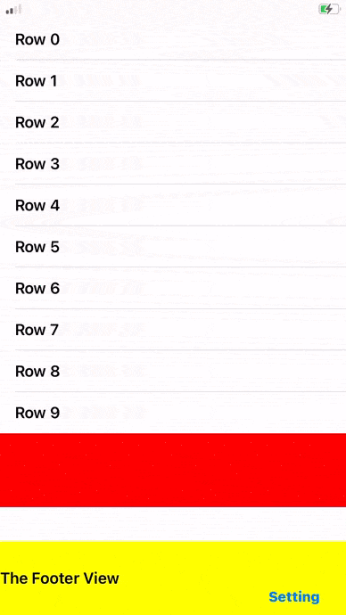

# StickTableFooterView-swift

### How to keep tableFooterView always on bottom of UITableView?

1. Creating an view as tableFooterView.
2. Creating an view and put it into tableFooterView as a subview(Pretended tableFooterView).
3. Setting porper layout constraints.
4. Enjoy your tableFooterView ticking on bottom of UITableView.

- Becuase the pretended tableFooterView is out of the bound of its superview, need to deal with the touch event. See ViewWithOutboundsButtons.m.

### About demo
- Red area refers the tableFooterView.
- Yellow area refers the pretended tableFooterView.
